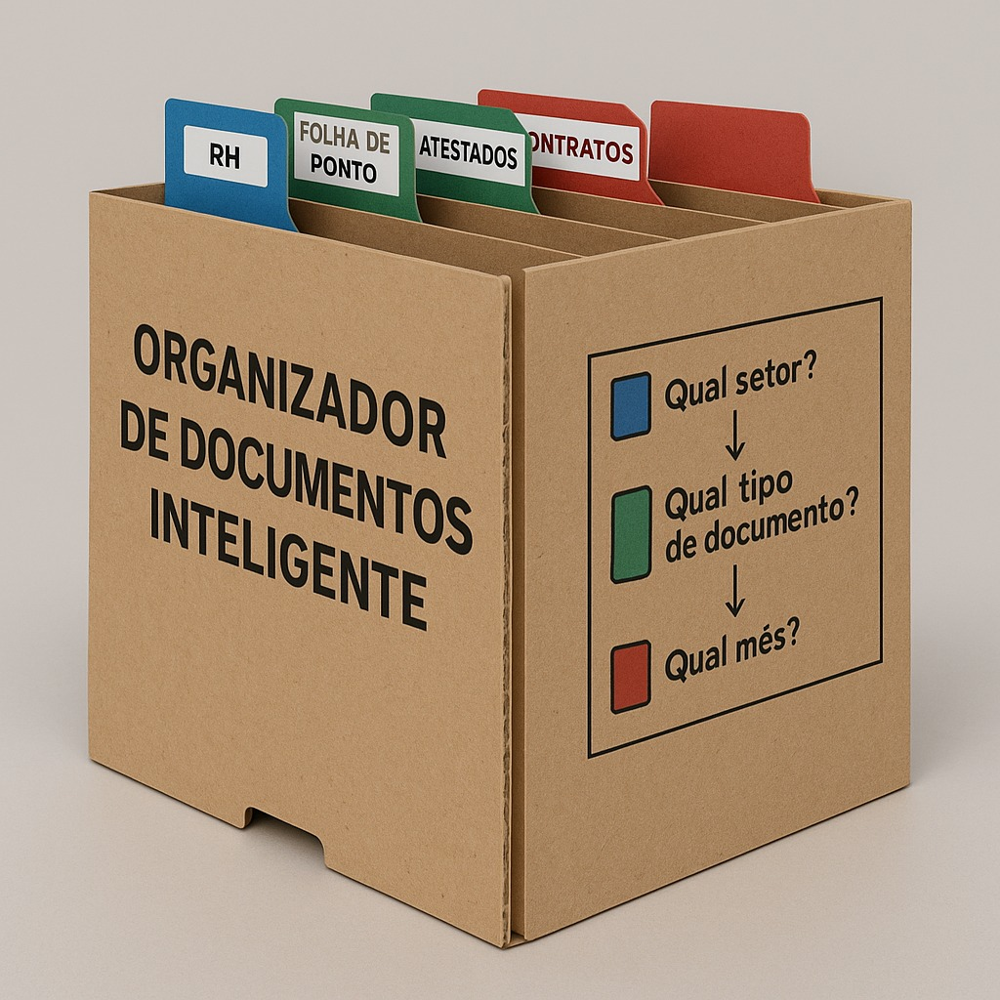
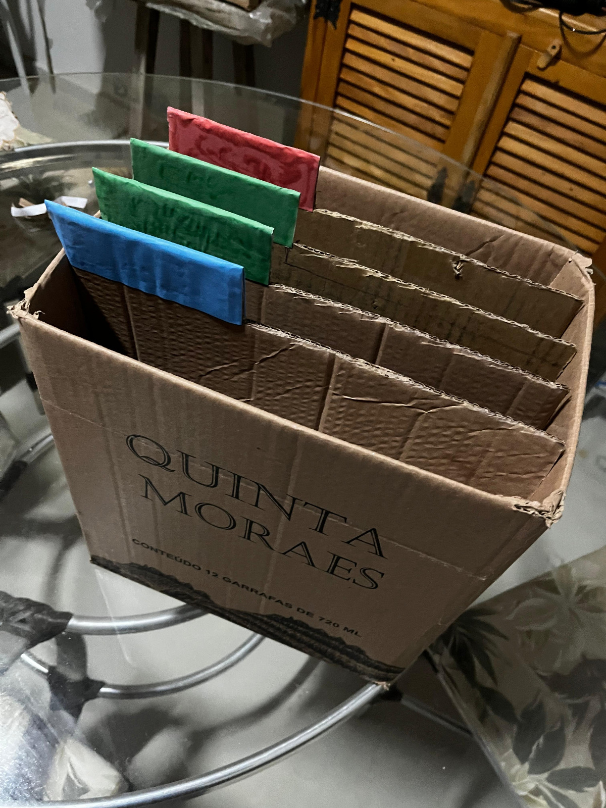

### Diário de Bordo – Criação de Caixa Organizadora

#### Integrantes:

- Tharik Lima da Silva = 43676642
- Pedro Gabriel Castro da Silva = 42832152
- Matheus Henrique Teixeira Santos = 43608124
- Ricardo Aguiar Arapa = 42618156

#### Ideia:

Projeto: Caixa organizadora multifuncional
Período: 01 a 05 de maio de 2025
Objetivo: Criar uma caixa organizadora prática, resistente e personalizável, utilizando materiais acessíveis e técnicas de montagem simples.

📅 Dia 1 – Data: [23/04/2025]

A primeira ideia era fazer uma luminária, mas foi descartada por envolver energia elétrica.

Em grupo, decidimos criar um Organizador de Documentos Inteligente, feito com papelão e divisórias ajustáveis, usando QR Codes para tornar o produto mais informativo e funcional.

O objetivo é facilitar a organização de documentos físicos em empresas de forma ecológica.

📅 Dia 2 – Data: [26/04/2025]

##### Materiais definidos:

- Caixa de papelão reciclada

- Cola quente

- Tinta acrílica para acabamento e cores das divisórias

- Cartolina colorida ou papel reciclado para abas e etiquetas

- Impressão de QR Codes

- Esboçamos a estrutura interna com divisórias móveis e coloração por setor.

  

📅 Dia 3 – Data: [30/04/2025]

Montamos a estrutura da caixa com papelão reforçado.

Pintamos e recortamos as divisórias ajustáveis, permitindo reconfiguração conforme a necessidade.

Criamos etiquetas coloridas para representar setores (RH, Financeiro etc.), tipos de documento (atestados, folha de ponto) e meses (01, 02, 03...).

 

Geramos QR Codes e colamos nas abas e na lateral da caixa.

📅 Dia 4 – Data[01/05/2025]
Verificamos a resistência da estrutura e a mobilidade das divisórias.

Testamos os QR Codes com celulares — todos funcionaram e levaram a páginas informativas simuladas (como Google Docs ou vídeos explicativos).

Fizemos acabamento nas bordas com tinta para melhorar a apresentação visual.

📅 Dia 5 – [05/05/2025]
O grupo apresentou o projeto mostrando cada funcionalidade:

Separação inteligente por abas

Sustentabilidade na construção

Interação com QR Codes

Explicamos como o projeto se conecta com o pensamento computacional mesmo sem o uso de eletrônica.
